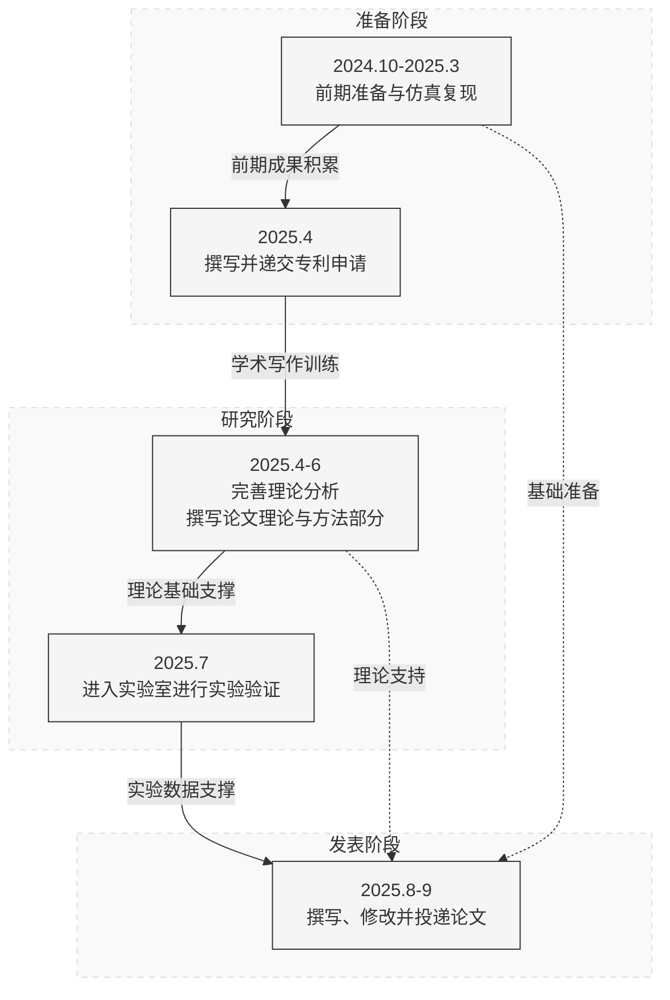

  <h1>具备电网故障穿越能力的双馈风力发电机无位置传感器控制技术研究</h1>
  
答辩人：曾文博

  
指导老师：王涛

---
 
# 目录

  
1. 研究初衷与研究现状 Research Motivation & Current Status

  
2. 前期工作与前期成果 Preliminary Work & Achievements

  
3. 关键问题与未来工作 Key Issues & Future Work

  
4. 申请人简历 Applicant's Resume

---
  
# 目录

  
1. 研究初衷与研究现状 Research Motivation & Current Status

  
2. 前期工作与前期成果 Preliminary Work & Achievements

  
3. 关键问题与未来工作 Key Issues & Future Work

  
4. 申请人简历 Applicant's Resume

---
layout: image-right
image: '/images/windturbine.png'  # 替换为您的图片路径
---

# 研究初衷与研究现状

## 研究初衷
- **风力发电**是应对全球能源问题的重要手段
- **海上风电**确定为可再生能源发展的重点领域
- 世界主流的风力发电机可分为**永磁同步发电机(PMSG)**和**双馈异步发电机(DFIG)**
- **位置传感器**精密的机械结构较易损坏，是风力发电机组的**薄弱环节**
- 这在海上潮湿、盐雾环境下尤为突出，极大增加了海上风电的运维成本
  

<v-click>

  是否有方法可以不依赖位置传感器，通过电机的电磁耦合特性算出转子位置？

</v-click>

---
layout: image-right
image: '/images/paper.png'  # 替换为您的图片路径
---

# 研究初衷与研究现状

## 研究现状
- PMSG的无位置传感器控制技术**较为成熟**，已在大多数产品中**批量应用**
- DFIG的无位置传感器技术虽已有一些**学术研究**，但**暂无用于批量产品**的报道
  
### 其主要原因是：
- 现有DFIG转子位置估计方法通常**仅适用于正常电网条件**
- DFIG定子**与电网直接相连**，电网故障时电机的定子电压、电流将受到直接而剧烈的影响，进而引起**转子位置估计误差**，导致**故障穿越失败**。
---
 
# 目录

  
1. 研究初衷与研究现状 Research Motivation & Current Status

  
2. 前期工作与前期成果 Preliminary Work & Achievements

  
3. 关键问题与未来工作 Key Issues & Future Work

  
4. 申请人简历 Applicant's Resume

---
layout: image-right
image: '/images/book.png'  # 替换为您的图片路径
---

# 理论基础
- 提前自学了《电机学》《控制论》等课程的相关部分
- 详细研读了多篇DFIG建模、控制相关的基础论文

  → **初步具备了DFIG控制相关理论知识**
- 围绕DFIG无位置传感器控制策略，通过IEEE Xplore等查阅了数十篇国内外文献
- 对现有控制策略进行了总结归纳，并撰写了**文献综述报告**

  → **初步了解了国内外DFIG无位置传感器控制的研究现状**
---
layout: image-right
image: '/images/MRAS.png'  # 替换为您的图片路径
---

# 三类Senosorless方法仿真复现

- 掌握了仿真软件Simulink的使用方法
- 仿真复现了**开环法**、**模型参考自适应法**以及**高频信号注入法**三类无位置传感器控制策略
## 仿真结果
- **开环法**严重依赖电机参数，闭环反馈机制缺失❌
- **高频信号注入法**严重影响发电质量，难以实际应用❌
- **MRAS**在稳态下能够准确跟踪转子位置和转速，转子位置观测角在暂态过程中收敛速度较快，具有低电压穿越的潜力✅

---
layout: image-right
image: '/images/your-image.png'
---

  

    
  

  

     <!-- 这里需要替换为第二张图片的路径 -->
  

# 基于电压前馈的初步成果
设计思路：将电网电压有关的项从闭环中分离出来，作为电压前馈项，从而提高故障穿越能力

- 基于电网电压前馈的思想设计闭环控制+前馈补偿系统
- 仿真结果表明，该方法能够**有效提高DFIG的故障穿越能力**

→

**基于该方法的初步成果已整理成文并向专利局递交专利申请**

---
layout: cover
background: /images/patent.png
class: no-logo-slide

---

## 基于该方法的初步成果已整理定稿

## 并已通过浙江大学科研系统递交专利申请

---
 
# 目录

  
1. 研究初衷与研究现状 Research Motivation & Current Status

  
2. 前期工作与前期成果 Preliminary Work & Achievements

  
3. 关键问题与未来工作 Key Issues & Future Work

  
4. 申请人简历 Applicant's Resume

---
layout: default
---

  

    <h3>Q1：现有方法的数学本质</h3>
    <ul>
      <li>现有方法的实现依靠直觉与感性认识</li>
      <li>如何从数学上解释其故障穿越能力？</li>
      <li>结合DFIG故障穿越暂态过程研究，定量描述其动态特性</li>
    </ul>
  

  
  

    <h3>Q2：电网电压前馈机制优化</h3>
    <ul>
      <li>现有前馈机制根据DFIG数学模型直接给出</li>
      <li>计算复杂，暂态过程不稳定</li>
      <li>对电网电压信息进行"预处理"，改进现有前馈机制</li>
    </ul>
  

  
  

    <h3>Q3：模型参数的整定</h3>
    <ul>
      <li>模型的关键闭环部分用到了PI控制器</li>
      <li>PI控制器的参数依靠经验与大量实验给出</li>
      <li>优化参数整定，给出其最优参数组合策略</li>
    </ul>
  

  
  

    <h3>Q4：与灭磁与无功支撑控制耦合</h3>
    <ul>
      <li>目前的仿真中均采用的是最基础的FOC控制</li>
      <li>实际工程中，故障条件下有特定的控制要求</li>
      <li>无位置传感器与上述控制策略耦合分析</li>
    </ul>
  

<h1 class="page-title">关键问题</h1>

---
layout: two-cols
title: 未来工作规划
---

<template v-slot:default>

</template>

<template v-slot:right>

# 未来工作规划

### 专利申请 (2025.4)
- 撰写专利说明书和权利要求
- 提交专利申请文件

### 理论完善与论文初稿 (2025.4-6)
- 完善理论模型和分析框架
- 进行数值仿真和初步验证
- 撰写论文的理论部分和方法部分

### 实验验证 (2025.7)
- 搭建实验平台和测试环境
- 收集实验数据并进行分析

### 论文撰写与投递 (2025.8-9)
- 整合理论和实验结果
- 完成论文撰写和修改
- 选择合适期刊并投递

</template>

---

# 目录

  
1. 研究初衷与研究现状 Research Motivation & Current Status

  
2. 前期工作与前期成果 Preliminary Work & Achievements

  
3. 关键问题与未来工作 Key Issues & Future Work

  
4. 申请人简历 Applicant's Resume

---
layout: two-cols-header
---

# 申请人简历
浙江大学电气工程学院-"爱迪生"班

::left::
## 学业成绩
- 主修绩点： 4.72/5.0
- 综合绩点： 4.72/5.0
- 学业排名： 4/152

## 荣誉与奖励
- 2023-2024 学年国家奖学金
- 2023-2024浙江大学一等奖学金
- 2023-2024 学年求是学院"新东方"奖学金
- 2023-2024 学年蓝田学园"十佳大学生"
- 2023-2024 学年优秀学生、创新创业标兵等

::right::
## 竞赛奖项
- 2024 浙江省大学生高等数学竞赛（工科类）一等奖
- 2024 浙江省大学生物理创新竞赛二等奖
- 2024 全国大学生英语竞赛国家级三等奖

## 研究经历
- 2024-2025：校级SRTP 逆变器功率器件开路故障诊断  
            &emsp; &emsp; &emsp;&emsp;&emsp;资助金额：1200元
- 2024年10月-今：

&emsp;&emsp;在电气工程学院百人计划研究员王涛老师和国家杰青吴立建教授的指导下，自2024年10月起从事DFIG风电系统无位置传感器控制、故障穿越相关研究

---
layout: end
class: thank-you-slide
---
# 诚 挚 致 谢
请各位专家批评指正！

 
